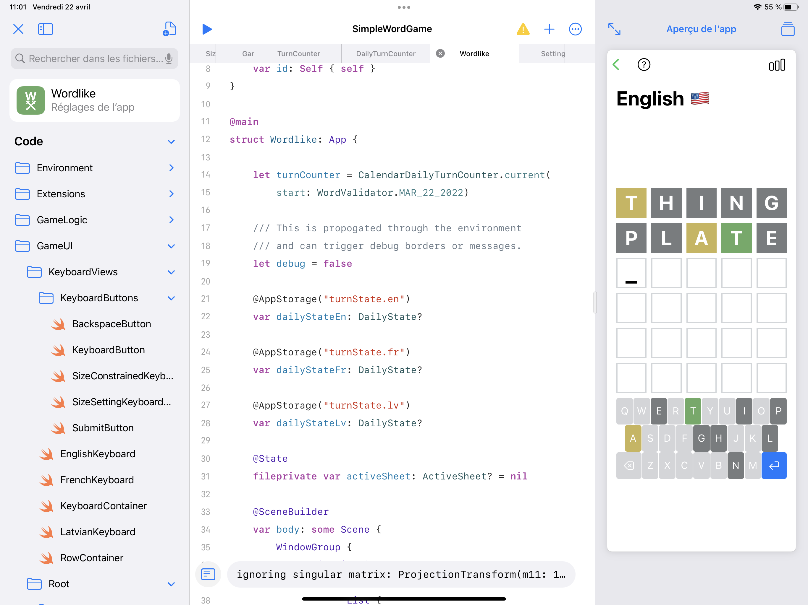

# Wordlike

A game written in SwiftUI using Swift Playgrounds 4.

The objective is to guess a word in 6 tries. A new round starts every day.

Available languages:

- English
- Latvian
- French

## Getting Started

- Install Swift Playgrounds 4
- Clone this repository on your iPad directly into the Swift Playgrounds 4 storage

Then open Playgrounds, and the application should be available.

## Credits

- English/British translations taken from <git@github.com:hyperreality/American-British-English-Translator.git>
- Latvian word list preparation relied on word analysis from <https://github.com/PeterisP/LVTagger.git> 
