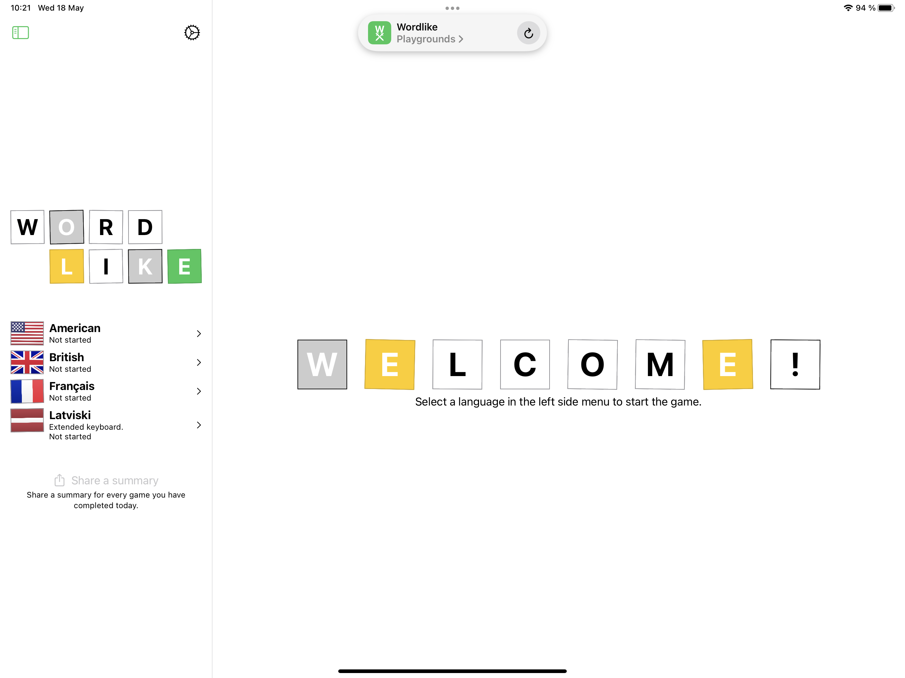

# Wordlike

A word game written in SwiftUI.

The objective is to guess a word in 6 tries. A new round starts every day.

Available languages:

- English
- Latvian
- French

## Swift Playgrounds

The original version of this app was written on an iPad using Swift Playgrounds.

You can find this version in the `ipad` branch.

## Credits

- English/British translations taken from <git@github.com:hyperreality/American-British-English-Translator.git>
- Latvian word list preparation relied on word analysis from <https://github.com/PeterisP/LVTagger.git>
